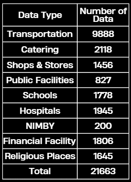

# Assessing Standard Values of Houses in Tainan City

 

 
 
   * Demo

# ▌Introduction

Through a data science project for the Finance and Taxation Bureau, Tainan City Government, the researcher model the spatial distribution of location adjustment parameters with Multiple Input CNN for assessing standard values of houses in Tainan City, Taiwan.

For "POIs with a smaller range of influence" and "POIs with a larger range of influence", a grid of 100m*100m is used as the basic unit, and the number of various POIs in each grid is used as the value of this grid, which is trained by CNN with various POI data in latitude and longitude format. For the numerical data of a single point, Linear Regression is applyed to promote the performance of the prediction.

The features extracted by the three models (two CNNs, one Linear Regression) are combined, and then the fully connected layer is used to learn the feature of the location rate.

# ▌Location Adjustment Parameters X Smart City

# Research Motivation
- To refine and reasonably evaluate and formulate the Location Adjustment Parameters (LAP) of the housing tax base to assess standard values of houses, it is expected to process geographic data through GIS and build a deep learning model for factor quantification to improve business efficiency and governance quality.

# Research Purpose

   1.Visualize existing LAP and provide adjustment suggestions.

   2.Display business premises and other facilities in the system for reference to prosperity and convenience.

   3.Apply information such as the Assessed Present Value (Announced Land Price) and the Age of the Building to reflect the living value of the real estate.

   4.Utilizing scientific analysis tools to improve the suitability and objectivity of operation efficiency and LAP.

# ▌Data Collection & Data Processing

Expost Correlation Analysis
- Based on the existing data and the current LAP heat map, the shopping malls and  the financial institutions correlate more with LAP. At the same time, the age of buildings and disgusting facilities are both negatively correlated with LAP.

# Data Acquisition

｜POI 

     
  
 - POI Categories.

｜Land Use

- 18 types of land use status.

Data Processing

｜Numerical Data in Grid

- The data is randomly sampled, and each address is converted into latitude and longitude by TGOS and Google Map API, corresponding to the grid to which the place belongs, and the calculation is performed in 141X132 grids (18,612 in total).

｜Interpolation

- Fill in the missing LAPs in the grid. Although some areas are open spaces (such as schools, parks, etc.) without LAPs, adding them for model training and value acquisition may provide a reference for future land changes and rezoning.

# ▌Model Architecture

｜Multiple Input CNN

For "POI points with small influence range" and "POI points with large influence range", a grid of 100m*100m is used as the basic unit, and the sum of various POIs in each grid is used as the value of this grid for training.
Finally, the features extracted by the 3 models (two CNNs, one Linear Regression) are combined, and the fully connected layer is used to learn the LAP features.
